# 1.3 Land Cover and Land Use Classification


## 1.0 Learning objectives

At the end of this module, you will be able to: 

- Describe how spectral space or data space are used in multivariate classification
- Apply and compare three commonly-used classification algorithms
- Assess possible sources of error in the classification process arising from pre-processing, sensor choice, and training sample design


#### 1.1 Pre-requisites for this module

* Google Earth Engine (GEE) concepts
	* Getting a user account
	* Image handling in GEE
	* Basic syntax of functions
	* Basic image processing, including choice of imagery, cloud-screening, mosaicking and compositing

> NOTE:  These topics are covered in Module 1.1: Image mosaic/composite creation for Landsat and Sentinel-2 in Google Earth Engine


* Basic remote sensing concepts
	* The electromagnetic spectrum
	* Spectral reflectance
	* Recording of reflectance in bands


## 2.0 Background

#### 2.1 Spectral data space and classifiers
Before embarking on an image classification exercise, it is important to understand what is being classified. 

Terrestrial remotely-sensed imagery, whether from passive or active sensors, responds to the physical and chemical properties of the surface.  The varied reflectance and absorptance of electromagnetic energy is recorded in different bands of a sensor, and the numeric values recorded in those bands define a spectral space (or more broadly, an n-dimensional data space). All pixels in an image are placed in this data space by virtue of their measured reflectance in each spectral band of the sensor. 

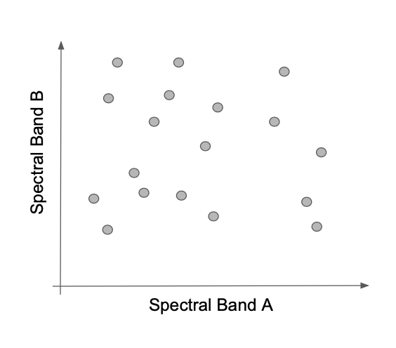

Most classification algorithms operate entirely in this data space. Classifiers attempt to separate the space into bounded regions within which all pixels belong to a labeled class.  Some classifiers consider the bounds between regions to be hard, while others are fuzzier, treating membership in class as a probability.  

 

Once the bounds of the class have been defined in spectral space, any other pixels in the image can be label according to the area in which they land. 

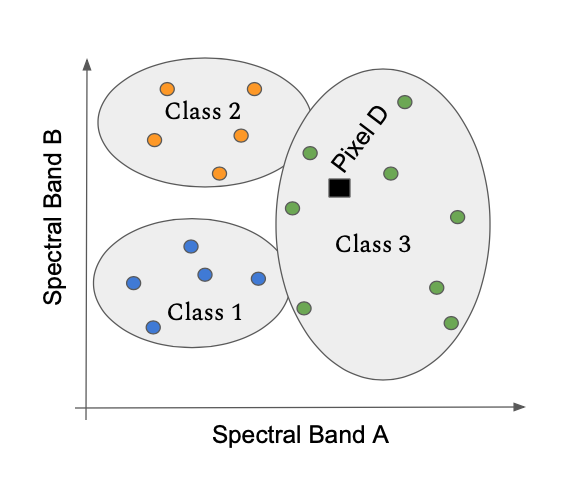


#### 2.2 Land cover vs. Land use

The physical and chemical properties of the surface are related to land cover. When collecting training data to build a classification, the more closely the definitions of land cover correspond to the physical properties of the surface that control the spectral data space, the more successful the classification exercise.  

"Land use" refers to a human definition overlaid on the underlying land cover.  The same herbaceous vegetation land cover may have different land use designations:  grass in an urban area may be defined as "open space" or "park", while the same grass in an agricultural area may be considered "pasture."  Care must be taken when defining classification labels to be aware of potential ambiguities in the spectral properties of classes. 


#### 2.3 Other Resources

**Concept**|**Source**|**Site**
:---:|:---:|-------:
Basics of remote sensing|Natural Resources Canada|https://www.nrcan.gc.ca/maps-tools-publications/satellite-imagery-air-photos/tutorial-fundamentals-remote-sensing/9309
Fundamentals of Remote Sensing|ARSET (NASA Applied Science)|https://appliedsciences.nasa.gov/join-mission/training/english/fundamentals-remote-sensing

## 3.0 Supervised Classification in Google Earth Engine

#### 3.1 Overview of workflow

Supervised classification refers to the process of using a training dataset with known labels to guide a mathematical classifier in the task of labeling spectral space. They key characteristic is that the training dataset guides (or "supervises") the labeling. 

Although the specifics of the steps vary by classifier, the [supervised classification workflow in GEE](https://developers.google.com/earth-engine/guides/classification) is similar across most variants. 

- Get an image
- Get training data
- Train a classifier or clusterer
- Apply that classifier to the image

Graphically, the steps are as follows. 

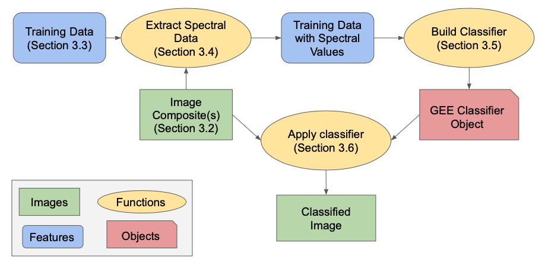

This creates a map.  You will then need to evaluate how accurate that map is. This is covered in the later module on accuracy assessment.

We will work through a simple example with the components noted below, and then illustrate variants on it. These instructions presume that you have an account on GEE, and are familiar with the setup, data formats, and functions in GEE.  If you need help with these steps, please go back to Module 1.1.


**Classification component**|**Item used here**|**Module**
:-----:|:-----:|:-----:
Image|Landsat 8 composite from a single year|Module 1.1
Training data|Point data|Module 1.2
Classifier|CART|Current Module


###### 3.1.1 Get set up:  Load the script
1. Log in to GEE's Javascript code editor at code.earthengine.google.com
2. *Optional* Set up a new repository for your work  

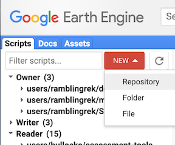

3. Open this [GEE script](https://code.earthengine.google.com/37dac7246f3c2c0603516eab4c5b490a)
4. Save it to your favorite folder

> Hint: You will need to make one alteration to the file to be able to save it under a local name.  Add a space somewhere in the script, then use the "Save As" function. 


	
5. Use the "Run" button to run the script


#### 3.2 Build image composite

The first chunk of code builds from the prior module on image compositing methods.  We build a Landsat 8 surface reflectance image collection from 2019, filtered by cloud cover, applied a median value, and clipped to the bounds of the country.  The details of these steps are covered in Module 1.1. 

- The key chunk of code: 

```javascript 
var l8compositeMasked = l8.filterBounds(country)
                .filterDate(startDate,endDate)
                .filterMetadata('CLOUD_COVER','less_than',50)
                .map(maskL8srClouds)
                .median()
                .clip(country);
```

Below is an image of a small area of Colombia in the region around Medellin.  The color combination here uses the shortwave infrared, near-infrared, and red bands in the Red, Green, and Blue color guns of the display.  Forest appears green, while built-up areas are magenta.  Note that there are areas in grey for which no valid pixels were found -- these are areas of persistent cloudiness. 

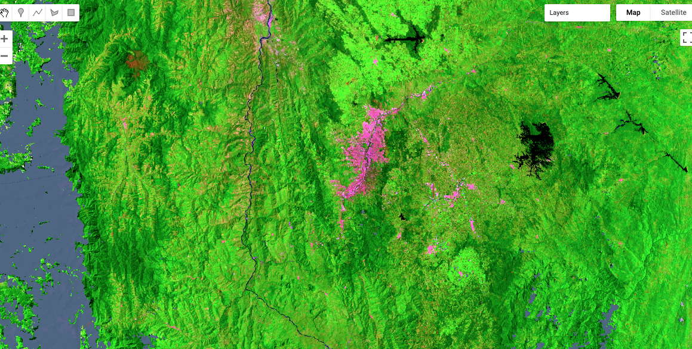


#### 3.3 Load training data
Training data are the observations that we will use to build the classification. As noted above, the definitions of the class labels of these training data should be defined with consideration of the spectral properties of the surface.  

For this exercise, we will use training data collected under the methods described in the modules on reference data collection (Module 1.2).  These data are included as an asset in the script provided above.  Alternatively, these can be added in a GEE script using: 

```javascript
var training = ee.FeatureCollection(
'users/ramblingrek/colombia_training_4class_nov1');
```

>Terminology:  In GEE, datasets such as these training points are defined as a "FeatureCollection".  For users familiar with the concepts of shapefiles or similar vector representations of geospatial data, the two are essentially the same. In GEE, vector data have a "geometry," which contains the geographic position of the points, lines, and polygons of a vector object, as well as the attributes that record the information about those geometries. Taken together, these make up a single "Feature", such as a single point or polygon.  Many of these together are considered a "FeatureCollection".  


For reference, we defined the class codes and labels in the prior module as follows: 

**Class code**|**Class label**
:-----:|:-----:
1|Forest
2|Water
3|Herbaceous
4|Developed


> **Advanced usage:**  For later interpretation, it is useful to color code these these classes.  See the code for an approach to color each interpreted point according to a color scheme defined using hexadecimal codes. 

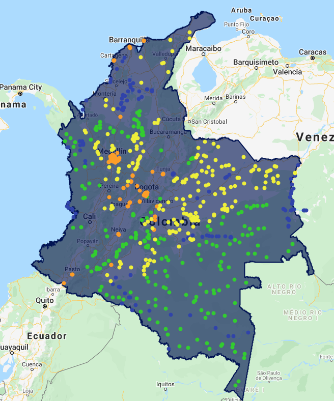


#### 3.4 Associate training points with spectral values

Next, the spectral values of the image are extracted at the locations associated with the training points.  First, the spectral bands of the image must be specified, and then the ".sampleRegions" operation is applied to the image.  

The full code is as follows: 

```javascript
// For classification, we will use the visible, near infrared, and shortwave infrared bands

var bands_to_use = ['B2', 'B3', 'B4', 'B5', 'B6', 'B7']


// Now do a spatial overlay of the points on the image, and extract 

var landcover_labels = 'landcover'

var training_extract = l8compositeMasked.select(bands_to_use).sampleRegions({
  collection: training_points, 
  properties: [landcover_labels],
  scale: 30
});
```

***Parsing the code:***  
```javascript
	var bands_to_use = ['B2', 'B3', 'B4', 'B5', 'B6', 'B7']
```
The band names can be found in the description of the original image source, here Landsat 8.  Note that the names are specified as a list of string values. 


```javascript
var landcover_labels = 'landcover'
```
This specifies which attribute in the FeatureCollection holds the labeled values.  As noted in Module 1.2, this label must be a numeric code. 


```javascript
var training_extract = l8compositeMasked.select(bands_to_use).sampleRegions({
  collection: training_points, 
  properties: [landcover_labels],
  scale: 30
});
```

The `.sampleRegions` function requires information about the feature collection to be used, the attribute (property) to extract, and the pixel scale (in meters).  

At the end of this step , the `training_extract` FeatureCollection contains the spectral values from the `bands_to_use` and the labels from the training points.  

To confirm that the object has these properties, you can use the `print(training_extract)` command to see in the Console the object's properties. An example is shown below: 

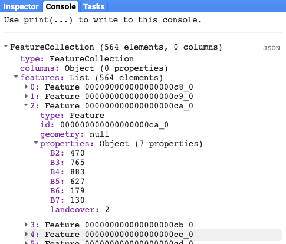

The FeatureCollection has as many features as the original training data, but note that each feature now has attributes for the spectral bands that you specified with the `bands_to_use` variable.  

Note that this base FeatureCollection can now be used in any of the GEE classifiers. 


#### 3.5 Build a CART classifier

Next, we use a CART classifier to find the best method to use the spectral values to separate the labels.  The classifiers known as Classification and Regression Trees (CART) partition the spectral data space successive binary splits arranged in a tree form. 

Graphically, classification trees identify lines that successively split the data space to separate the training points into their classes. 

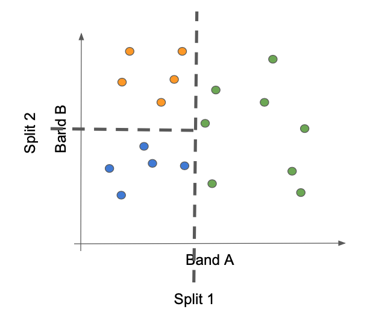

In GEE, this is a simple one-step call: 

```javascript
var trained_CART = ee.Classifier.smileCart()
  .train(training_extract, landcover_labels, bands_to_use);
```

The variable `trained_CART` is a classifier that then can be applied back to the image from which the `.sampleRegion` function was applied (see next section). Essentially, the classifier is an encapsulation of the mathematical rules that link spectral bands to labels. 

Viewing the object using the `print()` function in GEE, the basic characteristics of the object can be confirmed: 


#### 3.6 Apply classifier to image

Once a classifier has been built, the application of the mathematical rules to the original image results in a labeled map.  Each pixel in the spectral image is evaluated against the mathematical rules in the classifier, and the label assigned using those rules. 

Application of the classifier in GEE is a single line of code to create the classified image, and another to add it to the map: 


```javascript
var classified_CART = l8compositeMasked.select(bands_to_use).classify(trained_CART);

Map.addLayer(classified_CART, {min:1, max:4, 
  palette:['25CF1C', // forest
  '2E3FAC', // water
  'EFF215',  // herbaceous
  'FE9D02']}, // Developed
 
  'CART Classification'
)
```

***Parsing the code***

```javascript
var classified_CART = l8compositeMasked.select(bands_to_use).classify(trained_CART);
```
This step applies the classifier object to the image -- noting that the image must be the same as the one used to build the `trained_CART` object.  

The output of this process is an image.  Below, we add the image to the map, and specify the color rendering for the classes.  


```javascript
Map.addLayer(classified_CART, {min:1, max:4, 
  palette:['25CF1C', // forest
  '2E3FAC', // water
  'EFF215',  // herbaceous
  'FE9D02']}, // Developed
 
  'CART Classification'
)
```

Tip:  Note that we must keep track of the class code numbers to know which order to apply colors.  

Applied to the country of Colombia, the map appears as follows:

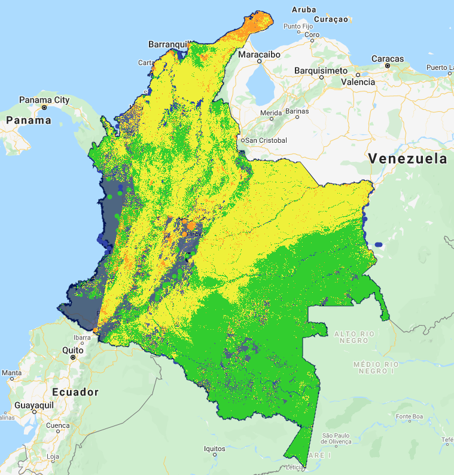

It is worth reiterating that the training points used to build this map were not intended to be useed in creation of high quality maps. Thus, the map created here is simply an exercise, and is not meant as an actual map of land cover cover in Colombia.  However, we will use it to show steps for evaluating and improving it. 

#### 3.7 Evaluating and improving maps

Ultimately, the accuracy of the map will be evaluated using a design-based sample with a process described in later modules.  However, it is often worthwhile to evaluate a map visually to find egregious errors and iteratively improve on the map before taking the time to build a robust accuracy sample. 

Several problematic issues are evident in the CART map shown here. 

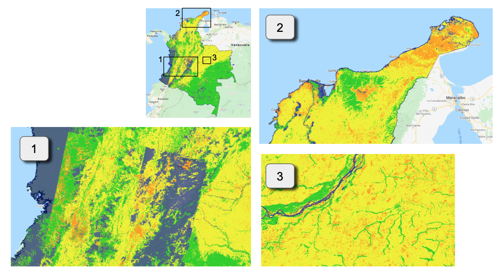

1. Missing pixels caused by cloudiness
As noted above, the image composite for this region in 2019 had substantial area where the masking of pixels for clouds resulted in no valid pixels for the image composite. These areas cannot be classified, as they have no spectral values on which to apply the classifier. 

2. Large geographic areas classified as "developed" 
In the north of the country on the Guajira Peninsula, the entire area is classified as developed, when in fact the area is dry and sparesely vegetated with little urban development. 

3. Substantial areas of developed interspersed with grassland
In the plains of the northeast of the country, herbaceous classification is interspersed with developed classes. 

###### 3.7.1 Options for cloud masking issues

When working with passive optical data, cloudiness is a common problem in many parts of the world.  Options to improve image availability include:

######## 3.7.1.1 Adjust thresholds for masking cloudy images
In our examples thus far, we have filtered out individual Landsat images with greater than 50% of the area clouded, according to image metadata.  This filtering occurred in our image compositing step:  `.filterMetadata('CLOUD_COVER', 'less_than', 50)`.  This filters out entire Landsat image acquisitions, even if some of the pixels in those images may be useful. 

- While it is often advisable to be conservative when filtering clouds, if it leads to large gaps in imagery as observed here, it is worth omitting the filter at the scale of whole images, and instead rely on per-pixel filtering captured in the function called using `.map(maskL8srClouds)`. 

- For the purpose of example, the entire workflow is recreated in the `cls_landsat_v1` script in the section labeled 3.7

- Omitting the 50% cloudiness metadata filter results in the following map: 


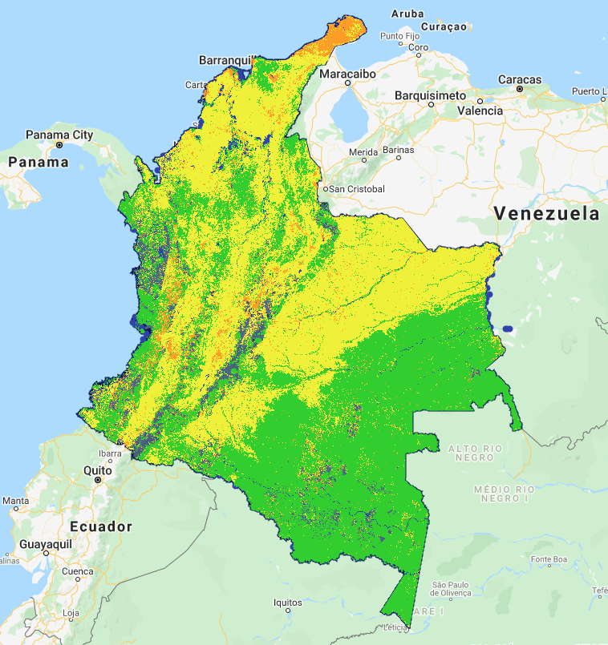


This substantially improves the situation, but does not entirely solve it. 

######## 3.7.1.2 Expand the mosaic to include more years of data  

- Land cover maps are associated with the year in which imagery was acquired. In the examples thus far, we have focused on imagery from the year 2019. Training data points were also acquired in the year 2019 for this exercise. 

- While constraining both imagery and training data to a single year is laudable, maps with missing values are problematic.  Depending on the intended use of the map, an option to improve the coverage of the map may be to expand the number of years of available for the image compositing. 

- In our example GEE script `cls_landsat_v1`, we have provided an example of how additional years of imagery can be merged to an image collection before image mosaicking.  The brute-force approach is to simply build two image collections and then use the GEE method `.merge()` to combined them.  Hence: 


```javascript
// Build a composite from 2019.  
// Note that we use the "l8" collection already identified 
// at the very top of this script.

var startDate = '2019-01-01';
var endDate = '2019-12-31';

var l8compositeMasked2019 = l8.filterBounds(country)
                .filterDate(startDate,endDate)
                .map(maskL8srClouds);

// Now add 2018

var startDate = '2018-01-01';
var endDate = '2018-12-31';

var l8compositeMasked2018 = l8.filterBounds(country)
                .filterDate(startDate,endDate)
                .map(maskL8srClouds);
          
// Now combine and get the median() value

var two_year_composite = l8compositeMasked2019
                .merge(l8compositeMasked2018)
                .median()
                .clip(country);
```

The resultant image has substantially fewer gaps. 

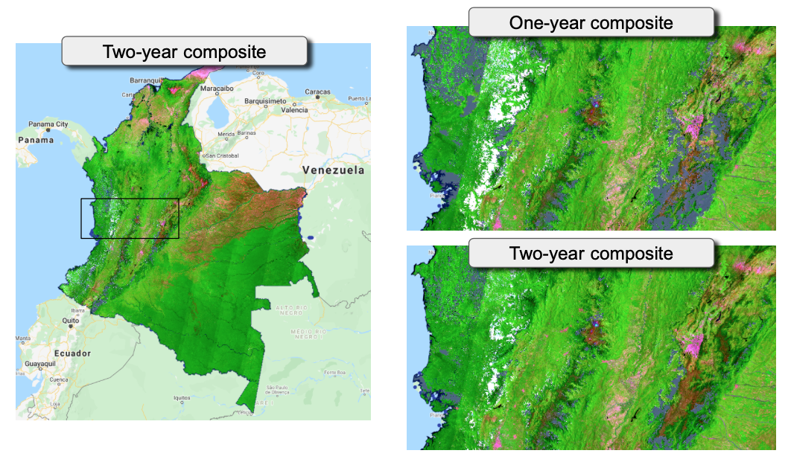

There are still gaps near the coast and at high elevation. It maybe neccessary to increase to a third year, or to consider an approach to bring in other sources of imagery (see below). 

However, using the two-year composite and re-running the CART classifier, the spatial pattern of classes shows fewer image artifacts. It 

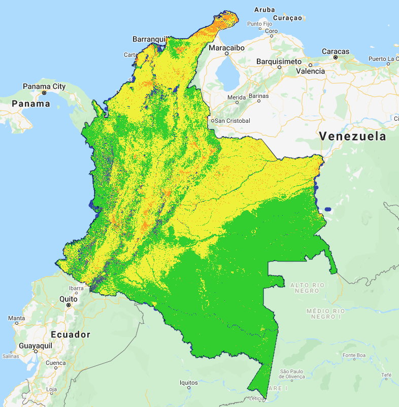


###### 3.7.2 Handling classification errors

Closer scrutiny of two areas confirms that the "developed" class is being assigned to pixels that are either herbaceous or even barren.  This is evident, even with the two-year compositing identified in 3.7.1.2. Although our training samples are not intended to be an actual source for robust mapping, we can use this example of misclassification to illustrate how it can be handled. 


Similarly, a close evaluation of the plains in the east-northeast of the country near the Meta River shows an overclassification of developed area, apparently caused by areas that are sparsely vegetated. 


######## 3.7.2.1. Options for handling misclassification errors

To understand how to fix misclassification, one must have an appreciation of the cause: Misclassification occurs when a pixel of one class lands in the spectral data space that the classifier has assigned to a different class. 

Using the simple cartoon shown earlier for the CART classifier, we can envision at least two cases where this can occur.  

Case 1:  A new pixel is encountered that lands in the part of spectral space already occupied by members of a different class.  This situation can occur when the two classes do not have sufficient spectral differences to be separated, or when density of training points is sparse enough that such apparently different lobes of spectral space are not sufficiently bounded.  

Case 2: A new pixel is encountered in a region of spectral space that does not have training samples, but which must be assigned a label by virtue of the splits identified by thte training samples that did exist.  


At least three remedies exist for Case 1: 
- Provide more dimensionality to the spectral data space.  Points that cannot be separated in a 2-d plane may be separable along a third axis, for example.  This requires adding spectral information at the beginning of the classification process.  The chance for success improves if that new dimension of data is thought to capture some characteristic that an expert might identify as separating the confused types.  For example, adding in a component that captures seasonality may separate two forest types that differ in the timing or duration of leaf condition. 

- Obtain more training points in the conditions that are causing confusion.  By adding more points in parts of the spectral space where confusion is occurring, the classifier has a better chance of separating that group into the appropriate class. 

- Apply a more flexible classifier to the same dataset.  A CART is a fairly simple classifier. It is possible that a more advanced classifer could achieve better rsults with the same training data.  See Section 3.8 for an example. 

Case 2 is a classic example of extending a statistical model outside the bounds for which it was built.  The best remedy for this case is to obtain more sample points in the region where confusion occurs, with the goal of extending the domain of the training. 


#### 3.8 Applying a different supervised classifier: Random Forests

The Random Forests algorithm (Breiman 2001:  "Random Forests". Machine Learning. 45 (1): 5–32) builds on the concepts of decision trees, but adds strategies to make them more powerful. Although a thorough treatment of Random Forests (RF) is beyond the scope of this training, a brief overview is presented here. 

The RF algorithm generates many decision trees (many "trees" make a "forest"), each with slightly different randomizations of both training data and predictor (here, spectral) data. Each split in a given decision tree is done with a subset of the training data and the spectral values.  This improves robustenss to outlier training points or predictor varriables.  When these many decision trees are built and then applied to the imagery, each pixel receives a label from each of the trees;  the final label is often taken as the one that occurs in the majority of trees for that pixel. 

Because the extraction of training data is the same for all classifiers in GEE, we need only build the new classifier from the prior training data, and then apply that to the image.  We will use the two-year composite image from section 3.7. 

First, we build the classifier.  (Note that `training_extract_v3` is defined earlier in the script as an extraction from the two-year composite) : 

```javascript
var trained_RF = ee.Classifier.smileRandomForest(250)
  .train(training_extract_v3, landcover_labels, bands_to_use);
```

And then apply it to the image:
```javascript
var classified_RF = two_year_composite.select(bands_to_use).classify(trained_RF);

Map.addLayer(classified_RF, {min:1, max:4, 
  palette:['25CF1C', // forest
  '2E3FAC', // water
  'EFF215',  // herbaceous
  'FE9D02']}, // Developed
 
  'RF Classification'
)
```

An inspection of some of the areas noted above suggests that the RF algorithm may be more robust to the misclassification problems, but that they still do exist. 

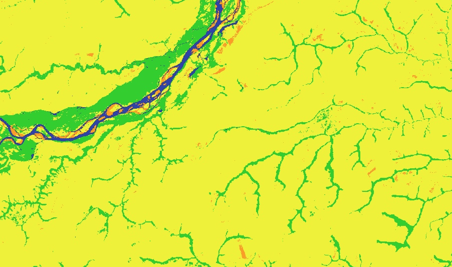

The area on the Guajira peninsula still remains largely misclassified.  This suggests that the training data to not adequately sample the spectral space of this class, and that more training data collected in this region would be beneficial. 


## 4.0 Unsupervised classification

A key challenge in supervised classification is to define classes that can be adequately separated in the spectral space of the imagery.  If the definitions of classes need not be strictly defined ahead of time, it can be possible to let the imagery find groupings (clusters) in the spectral space, and then attempt to attach descriptive labels to those clusters.  Because labeled training data are not used to guide this process, it is referred to as "unsupervised" classification.

#### 4.1 The *k*-means algorithm

Clustering algorithms are numerous.  The interested reader may consult https://en.wikipedia.org/wiki/Cluster_analysis or other generic introductions. In remote sensing, a commonly used approach is the *k*-means clusterer, implemented on GEE as the `ee.Clusterer.wekaKMeans` function.  

The *k*-means approach uses an iterative regrouping strategy to identify groups of pixels near each other in spectral space. The user supplies a desired number (*k*) of clusters, and the algorithm then distributes that number of seed points into the spectral space. These seed locations are considered starting points of the eventual classes. The location of these seed points defaults to a random placement in the GEE implementation of the algorithm. A large sample of pixels in the image is then assigned to its closest seed point, and the mean spectral value of those pixels calculated.  That mean value is akin to a center of mass of the points, and is known as the centroid.  Unless the points that were nearest to a seed point happened to be symmetrically arranged around it, this calculated centroid is going to be moved slightly from where it started.  All of the pixels in the image are now  re-attached to centroids -- often some pixels change centroids because of the movement of the centroids. When the new group of pixels is used for centroid calculation, the new centroid will move again.  The process is repeated until the centroids remain relatively stable and few pixels change from class to class on subsequent iterations. 

#### 4.2 Application of *k*-means in GEE

Application in GEE follows the same generaly workflow as that used for supervised classification, except that the training samples are generated randomly rather than taken from an interpreted training set.  These are not strictly "training" data, since they do not have labels.  Rather, they are a simply a random subsample of the spectral data space. 

The code for implementation is as follows. 

First, the random sample locations are chosen. 
```javascript
var randomtraining = two_year_composite.sample({
    region: country,
    scale: 30,
    numPixels: 500,
    tileScale: 10
  });
```

Then, the *k*-means algorithm is applied to the sample points chosen. 

```javascript
var numberOfClasses =10
var clusterer = ee.Clusterer.wekaKMeans(numberOfClasses).train(randomtraining);
```


Finally, the clusterer is applied to the image. 
```javascript
var unsup = two_year_composite.cluster(clusterer);
Map.addLayer(unsup.randomVisualizer(), {}, '10 Clusters')
```
Note that the colors of the classes are not related to any meaningful quantity, so a random visualizer is used.  The colors of the classes are not meaningful, but simply are used to distinguish the classes. 

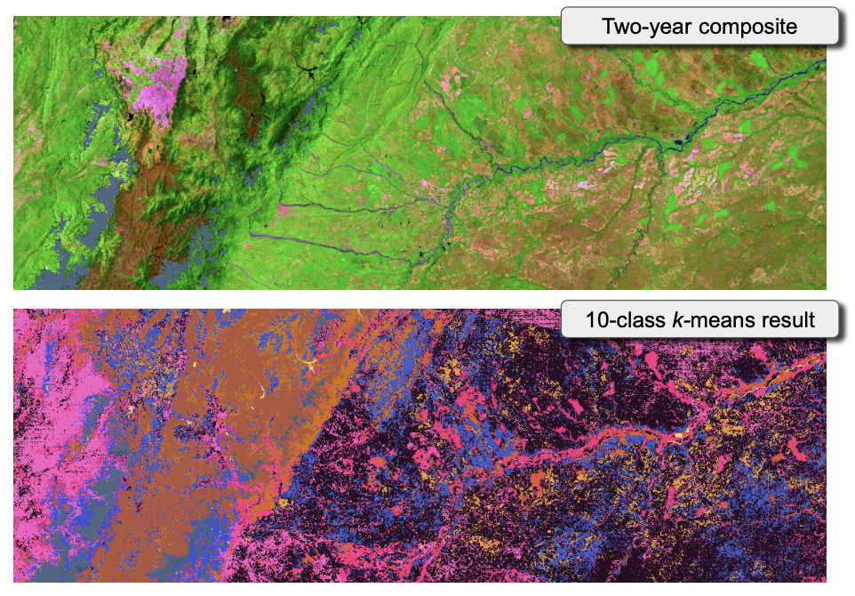


#### 4.3 Evaluation

Once the clustered image is created, an expert user can evaluate whether the choices used are effective, and can begin assigning land cover labels to the clusters. This is necessarily a more subjective strategy requiring understanding of both the landscape and the spectral data space. 

The first evaluation criterion is simply whether the spatial pattern of the clusters follows the spatial patterns of interest in the imagery.  If there are too few clusters, then boundaries between distinct zones on the landscape will be straddled by a single cluster.  conversely, if there are too many clusters, visually-homogenous zones will be split. 

The second (and related) criterion is whether the clusters can be assigned labels that are consisten with an expert's knowledge of the landscape.  

Remedies for too many or too few classes are to simply run the classification again, or take more advanced steps of subsetting the image into component classes and re-running the classiifer on the subset.  

#### 4.4 Advantages and disadvantages

Supervised classification presumes which classes are interesting or relevant, but rarely are those class labels constructed according to how well they will be captured in the spectral data space.  Thus, the supervised approach may try to make a spectral data space separate classes that are not separable. 

Unsupervised classification depends entirely on the imagery, and on separability of classes.  Thus, it may better represent patterns on the landscape.  But the labeling of those classes may not be useful for an end user.  Moreover, the method is entirely dependent on the data space, and thus a repetition of the same basic steps on a different set of images for the same location could very well lead to a different map.  

## 5.0 FAQs

*What if there are some areas that are almost always cloudy, no matter how many years of imagery I have?*

There are several options:

- If the areas take up a small percentage of the overall map, and if the purpose of the map is to estimate total area in different land cover classes, then it may be possible to consider these pixels as the class "unknown" and explicitly consider it when building accuracy tables and area estimates later on.  These will simply add greater uncertainty to the estimates of area. 
- Consider using another source of passive optical imagery instead of or in addition to your original image. For example, it could be possible to blend together Sentinel-2 imagery with Landsat imagery to include the odds of finding cloud-free pixel observations. 
- Consider using imagery from SAR (synthetic aperture radar) sensors that can map the land surface even in the presence of the clouds.  All sensor types have their own issues to consider when building maps, however, and radar imagery is no exception.  Please see the SAR Handbook [cite] for an in-depth treatment of SAR imagery. 


*Once I build a classifier in one year, can I then apply it to imagery in other years to make annual maps?*

The short answer is that this is not recommended.  The spectral data space of your training imagery is particular to the conditions under which it was recorded: per-pixel spectral values vary due to the vagaries of which dates of pixel had clear views, the degree to which the atmospheric correction was acccurate, the seasonality of the vegetation in one year versus another, etc.  To a first approximation, we hope that the overall link between spectral data and ground conditions is robust, but at the margins of classess, or in classes that have a high degree of variabilty from year to year, the differences can be quite dramatic.  There are two basic ways to approach this:  1) build new classifications in each year or 2) use a tool to stabilize spectral data across time.  


