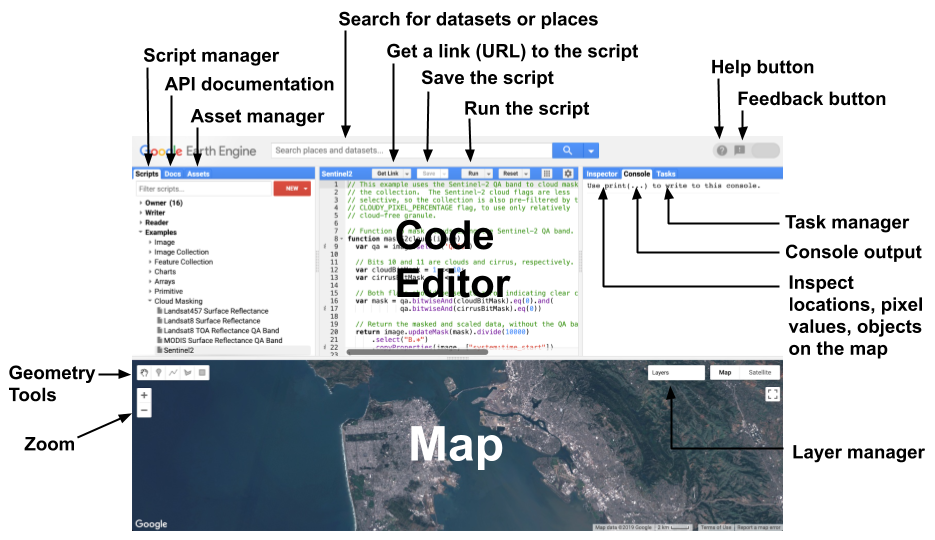
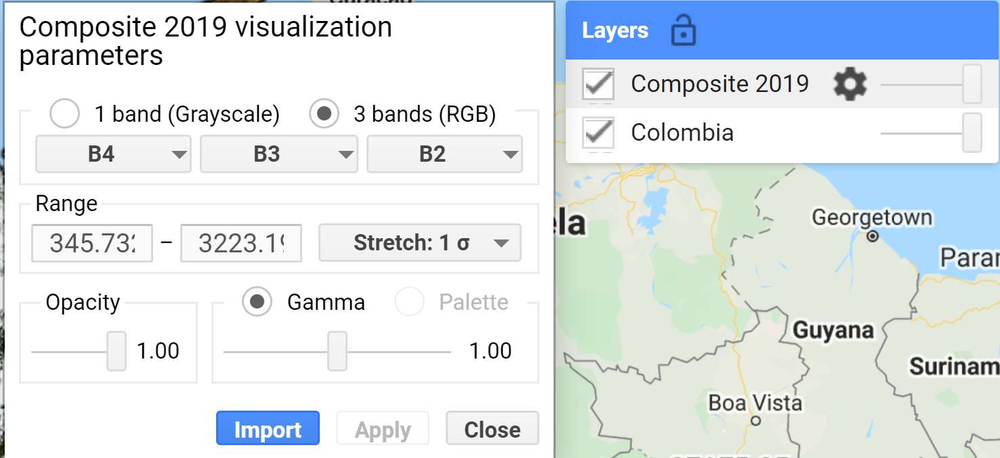
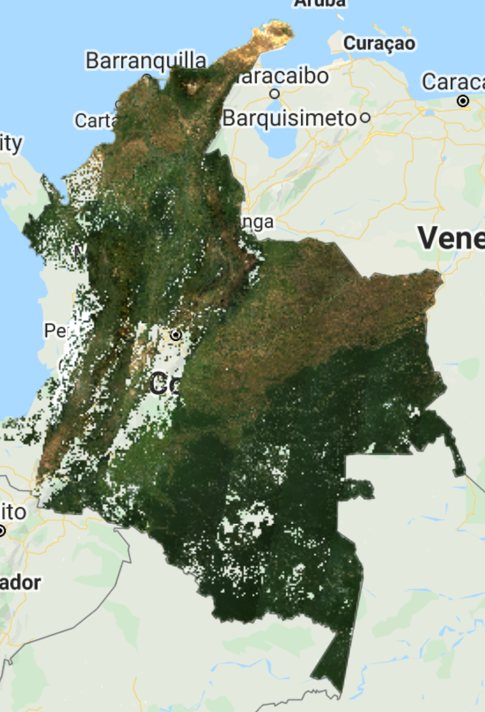
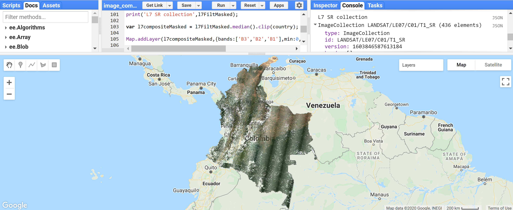
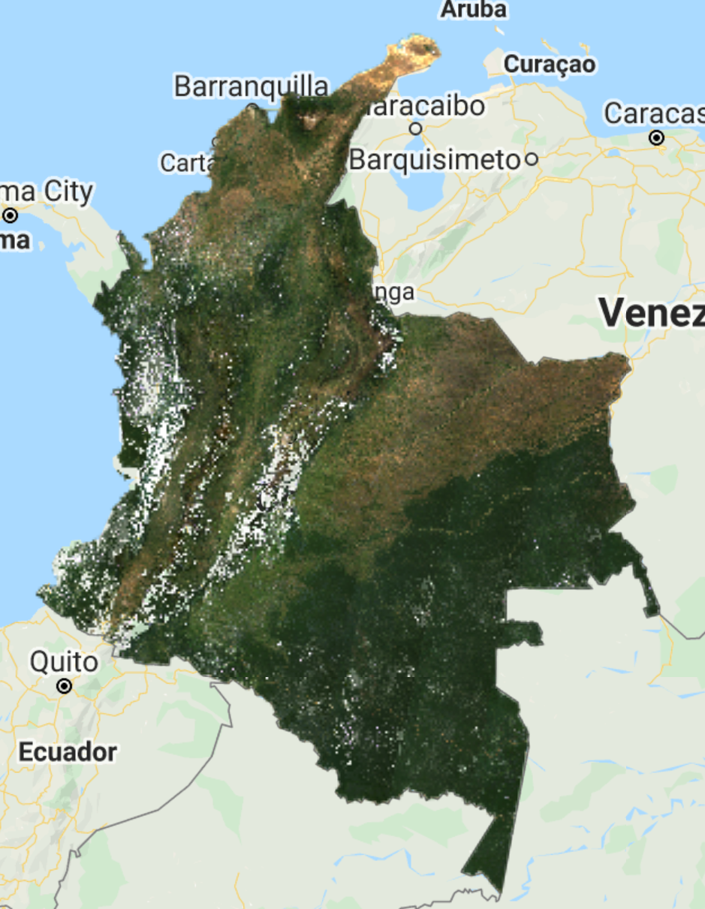
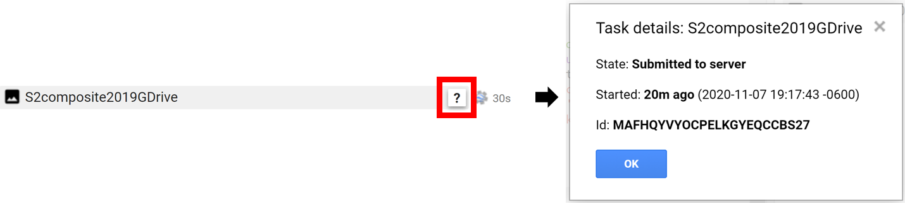

# 1.1 Image mosaic/composite creation for Landsat and Sentinel-2 in Google Earth Engine

## 1 Background

This tutorial will walk you through how to create a composite using Landsat and/or Sentinel-2 imagery on a national level in Google Earth Engine. Here, the process is demonstrated for the country of Colombia. The tutorial is accompanied by a Google Earth Engine repository that contains three scripts. These scripts enable you to create a composite that can be used in subsequent sections of this training.

### Repository

[This repository](https://code.earthengine.google.com/?accept_repo=users/openmrv/MRV) contains a subfolder called "Composite" with three scripts that perform all the operations that you will learn in this tutorial:

1. `Image_Composite_Landsat_Sentinel2_Median` contains all the steps in the order you will go through (except for section 4.2.5. Medoid composite) for creating a median composites using Landsat and Sentinel-2 Collections.
2. `Image_Composite_Landsat_Sentinel2_Median2` is an optimized version of the above script. It contains all user variables at the top and functions/code that do not need to be modified below.
3. `Image_Composite_Landsat_Medoid` contains the compositing method using the Medoid instead of Median for the Landsat Collections.

> NOTE: it is encouraged that you follow the steps below by writing the scripts on your own to have a better learning experience, and only use the above scripts for consultation during the tutorial, or after the understanding of all the processes here explained.

## 2 Learning objectives

* Learn how to create an image mosaic/composite

* Become familiar with a variety of options that include: selecting dates, sensors, and mosaicking methods
* Create a cloud-free mosaic/composite for Colombia for 2019
* Learn how to export the mosaic/composite


## 3 Google Earth Engine

### 3.1 Background

The appeal of using Google Earth Engine (GEE) is that GEE contains multi-petabytes of satellite imagery and geospatial datasets allowing users to compute massive-scale analysis in the cloud-based platform. GEE contains a JavaScript (used in this case) and a Python API, where users can upload their own datasets and use built-in functions  to accomplish a myriad of remote sensing and geospatial tasks at unprecedented speeds and scales. For more information about GEE please refer to [the main page about Google Earth Engine](https://earthengine.google.com/). There you can find useful tutorials and documentation. Some relevant links are highlighted below:

* [Datasets available](https://developers.google.com/earth-engine/datasets/) 
* [FAQs](https://earthengine.google.com/faq/)
* [Getting started with GEE](https://developers.google.com/earth-engine/guides/getstarted)
* [Introduction to the JavaScript API](https://developers.google.com/earth-engine/tutorials/tutorial_api_01)
* [Documentation](https://developers.google.com/earth-engine)
* [API reference](https://developers.google.com/earth-engine/apidocs)
* [Community tutorials](https://developers.google.com/earth-engine/tutorials)

{ width=80% }


Additionally, for fundamentals of Remote Sensing, you may refer to [NASA ARSET's Fundamentals of Remote Sensing](https://appliedsciences.nasa.gov/join-mission/training/english/fundamentals-remote-sensing) training. This includes basics of satellite remote sensing, including satellite orbits, types, resolutions, sensors, and processing levels. It is on demand and anyone can take it (Available only in English).

*Note*: [Google Chrome](https://www.google.com/chrome/) is recommended when using GEE.


### 3.2 How to sign up

Anyone can sign up for Google Earth Engine. GEE is free for non-commercial use. To sign up, please fill out [this form](https://earthengine.google.com/signup/). Once you have been accepted, you will receive an email with additional information. 


## 4 Creating a composite 

The general workflow of the process for this tutorial is demonstrated below: 

{ width=75% }


Now let's go through each of these steps. Open the code editor by typing [https://code.earthengine.google.com](https://code.earthengine.google.com) in your web browser. 


### 4.1 Area of Interest

To start, we need to define our area of interest. We will use the [Large Scale International Boundary (2017) simplified dataset](https://developers.google.com/earth-engine/datasets/catalog/USDOS_LSIB_SIMPLE_2017) by the United States Department of State (USDOS) which contains polygons for all countries of the world. Search "USDOS" in the *Search* box of the code editor and click on "LISB 2017: Large Scale International Boundary Polygons, Simplified".


A popup window will show the description, table schema (properties), and terms of use of this dataset.


Copy and past the code below to create a variable for this dataset.

```javascript
var lisb = ee.FeatureCollection("USDOS/LISB_SIMPLE/2017");
```

> NOTE: Alternatively, **any** GEE dataset can be added to your script by clicking the *IMPORT* button next to the dataset. The imported dataset will show up at the top of the code editor under *Imports* as a variable with a default name `image` for images, `imageCollection` for Image Collections, `geometry` for geometries, `table` for Feature Collections, and so on. You can change this name by clicking over the default name (in this case `table`) and writing the new name.

Now, let's filter this `FeatureCollection` to grab only the polygon for Colombia. We will do this by using the `filterMetadata` function in GEE. One of the LISB dataset's properties is called `country_na` and it represents the name of country (US-recognized) for each polygon. Therefore, we will filter our variable `lisb` by `country_na` that are equal to "Colombia". Copy and paste the code below to create a variable `country` for Colombia's boundaries.

```javascript
var country = lisb.filterMetadata('country_na','equals','Colombia');
```

To visualize this boundary, you can use the `Map.addLayer` function. But before, you should center the Map to this area of interest by using `Map.centerObject`. Copy and paste the code below to define the map center over Colombia and add the Colombia's polygon `country` to the map. Click *Run* to see the results. You will see that under *Layers* you will have a layer named "Colombia".

```javascript
Map.center(country,5);
Mad.addLayer(country,{},'Colombia');
```


> NOTE: Adjust the zoom level to your preference by changing the number `5` to any number between 1 and 24. You can use the slider under *Layers* on the map to change the opacity of the layer.


### 4.2 Landsat Collection

#### 4.2.1 Starting with Landsat 8

We will start creating a composite from the Landsat 8 collection. First, let's define two time variables that we will call `startDate` and `endDate`. Here, we will create a composite for the year 2019, so use the code bock below to define the time variables. Date objects are by default in the `YYYY-MM-DD` format.

```javascript
var startDate = '2019-01-01';
var endDate = '2019-12-31';
```

Now, let's define our Landsat 8 collection variable. We will use the [USGS Landsat 8 Surface Reflectance Tier 1](https://developers.google.com/earth-engine/datasets/catalog/LANDSAT_LC08_C01_T1_SR) product in GEE. This dataset is the atmospherically corrected surface reflectance from the Landsat 8 OLI/TIRS sensors. These images contains 5 visible and near-infrared (VNIR) bands and 2 short-wave infrared (SWIR) bands processed to orthorectified surface reflectance, and two thermal infrared (TIR) bands processed to orthorectified brightness temperature.

```javascript
var l8 = ee.ImageCollection('LANDSAT/LC08/C01/T1_SR');
```

> NOTE: If you try to `print` this collection, an error message will be returned in the Console. This collection contains the entire Landsat 8 archive from 2013 to the present day for the entire globe. Any print collection query will abort after accumulating the metadata for over 5,000 elements.

Next, let's filter this collection to our area of interest (Colombia, `var country`) and time period (`startDate, endDate`). We will use the `filterBounds` and `filterDate` functions.

```javascript
var l8Filt = l8.filterBounds(country)
			   .filterDate(startDate,endDate);
```

Print `l8Filt` to see your filtered collection. Click *Run* after adding the line below. The *Console* will show that the collection has 956 images.

```javascript
print('L8 SR collection filtered',l8Filt);
```

{ width=70% }

With your filtered collection, create a composite using a median filter. We will use the `median()` function for `ee.ImageCollection` and the `clip()` function to clip the composite to the area of interest. Copy and paste the code below and click *Run*. The output will be an `ee.Image`.

```javascript
var composite = l8Filt.median().clip(country);

Map.addLayer(composite,{bands:['B4','B3','B2'],min:300,max:3000},
             'Composite 2019');

print('L8 composite 2019',composite);
```

> NOTE: The `median()` function for `ee.ImageCollection` is what is called in GEE a `ee.Reducer`, we are using specifically the `ee.Reducer.median()` reducer. Reducers are the GEE way to aggregate data over time, space, bands, arrays, and other data structures. The figure below demonstrates an image collection to an individual image:
>
> { width=25% }
>
> For more information about Reducers, and reducing an Image Collection specifically, please check these pages:
>
> * [Reducer Overview](https://developers.google.com/earth-engine/guides/reducers_intro)
> * [ImageCollection Reductions](https://developers.google.com/earth-engine/guides/reducers_image_collection)
> * [Reducing an ImageCollection](https://developers.google.com/earth-engine/guides/ic_reducing)
>
> Alternatively, you can test using mean, min, etc, as reducers instead of median.
>
> 
>
> NOTE 2: There are a number of options available to adjust how images are displayed using the `Map.addLayer` function. The inputs that are most commonly used to modify display settings include the following:
>
> * Bands: allows the user to specify which bands to render as red, green, and blue. In the case above we are using Landsat 8's bands B4, B3, and B2 which correspond to red, green, and blue bands, respectively.
> * Min and max: sets the stretch range of the colors. The range is dependent on the data type. For example unsigned 16-bit imagery has a total range of 0 to 65,536. This option lets you set the display to a subset of that range. In this case, we set min as 300 and max as 3000 and these correspond to the surface reflectance values.
> * Palette: specifies the color palette used to display information. Not used in this case.
>
> You can test visualization parameters by clicking on gear icon  next to the layer "Composite 2019" and playing with the stretch options.
>
> { width=70% }


You should see a very cloudy image in the Map like the one above. Let's try adding a pre filter for clouds when filtering our collection. The Landsat collection comes with a property named `CLOUD_COVER`, and we can define a cloud cover percentage as a threshold to filter the scenes. We will use the `filterMetadata` function to filter images with cloud cover of less than 50%. Copy and paste the code below and click *Run*.

```javascript
var l8Filt2 = l8.filterBounds(country)
               .filterDate(startDate,endDate)
               .filterMetadata('CLOUD_COVER','less_than',50);

print('Landsat 8 SR collection filtered for clouds',l8Filt2);

var composite2 = l8Filt2.median().clip(country);

Map.addLayer(composite2,{bands:['B4','B3','B2'],min:300,max:3000},
             'Composite 2019 pre cloud filter');

print('L8 composite 2019 pre cloud filter',composite2);
```

You will see that this new composite looks slightly better than the previous one but still very cloudy. In the Console, also note that the new collection has 454 images compared to 956 in the previous not-cloud-filtered one.


Try adjusting the `CLOUD_COVER` threshold to different percentages and checking results. Example: with 20% set as the threshold, you can see that many parts of the country have image gaps. Additionally, some tiles, even with a cloud filter, still present large area cover of clouds.


This is due to persistent cloud cover in some regions of Colombia. We can apply a Cloud Mask to improve the results. The Landsat 8 collections contains a ["Quality Assessment (QA)" band](https://www.usgs.gov/core-science-systems/nli/landsat/landsat-collection-1-level-1-quality-assessment-band?qt-science_support_page_related_con=0#qt-science_support_page_related_con) called `pixel_qa` that provides useful information of certain conditions within the data, and allows users to apply per pixel filters. Each pixel in the QA band contains unsigned integers that represent bit-packed combinations of surface, atmospheric, and sensor conditions. Of particular interest here, are Bits 3 and 5 that represent cloud shadow, and cloud, respectively. 

We will create a `function` to apply a cloud mask to every image in the image collection by using the image collection function `map`. Copy and paste the code below and click *Run*.

```javascript
function maskL8srClouds(image) {
  // Bits 3 and 5 are cloud shadow and cloud, respectively.
  var cloudShadowBitMask = (1 << 3);
  var cloudsBitMask = (1 << 5);
  // Get the pixel QA band.
  var qa = image.select('pixel_qa');
  // Both flags should be set to zero, indicating clear conditions.
  var mask = qa.bitwiseAnd(cloudShadowBitMask).eq(0)
                .and(qa.bitwiseAnd(cloudsBitMask).eq(0));
  return image.updateMask(mask);
}

var l8FiltMasked = l8.filterBounds(country)
                .filterDate(startDate,endDate)
                .filterMetadata('CLOUD_COVER','less_than',50)
                .map(maskL8srClouds);

print('L8 SR collection filtered and masked', l8FiltMasked);

var l8compositeMasked = l8FiltMasked.median().clip(country);

print('L8 composite 2019 masked', l8compositeMasked);

Map.addLayer(l8compositeMasked,
             {bands:['B4','B3','B2'],min:0,max:2000},
             'L8 composite 2019 masked');
```



The resulting composite shows masked clouds and is a great improvement compared to previous composites. However, data gaps are still an issue. Luckily, the [Landsat collection spans different missions](https://www.usgs.gov/core-science-systems/nli/landsat/landsat-satellite-missions?qt-science_support_page_related_con=2#qt-science_support_page_related_con), which have continuously acquired uninterrupted data since 1972 at different acquisition dates. Next, we will try incorporating Landsat 7 images from the same time period to fill these gaps.

> NOTE: At this point, you probably have noticed that the layers are taking a while to load, i.e. the script is overall "slower". To avoid waiting too much to check results, and running into an `Earth Engine memory capacity exceeded` error, you can comment out some of the `print` and `Map.addLayer` statements by adding double forward slashes `//` at the beginning of the lines **or** by clicking on the desired line and pressing *Ctrl + /*. Use this strategy throughout the rest of this tutorial and only print and add layers to the map of desired composites.

#### 4.2.2 Adding the Landsat 7 Collection

Like Landsat 8, we will use the [USGS Landsat 7 Surface Reflectance Tier 1](https://developers.google.com/earth-engine/datasets/catalog/LANDSAT_LE07_C01_T1_SR) product in GEE. This dataset is the atmospherically corrected surface reflectance from the Landsat 7 ETM+ sensor. These images contain 4 visible and near-infrared (VNIR) bands and 2 short-wave infrared (SWIR) bands processed to orthorectified surface reflectance, and one thermal infrared (TIR) band processed to orthorectified brightness temperature. 

Let's first see how a Landsat 7 composite would look like for the sake of comprehensive understanding and completeness.

The next steps are very similar to the ones we did for Landsat 8. First, define your Landsat 7 collection variable.

```javascript
var l7 = ee.ImageCollection('LANDSAT/LE07/C01/T1_SR');
```

We will immediately apply a cloud mask to this collection since we saw that Colombia has consistent cloud cover. Let's define the cloud mask function for Landsat 7.

```javascript
function maskL7srClouds(image) {
  var qa = image.select('pixel_qa');
  // If the cloud bit (5) is set and the cloud confidence (7) is high
  // or the cloud shadow bit is set (3), then it's a bad pixel.
  var cloud = qa.bitwiseAnd(1 << 5)
                  .and(qa.bitwiseAnd(1 << 7))
                  .or(qa.bitwiseAnd(1 << 3));
  // Remove edge pixels that don't occur in all bands
  var maskL7 = image.mask().reduce(ee.Reducer.min());
  return image.updateMask(cloud.not()).updateMask(maskL7);
}
```

Let's filter the Landsat 7 collection with the same filters used for Landsat 8, apply the cloud mask, and create the Landsat 7 composite.

```javascript
var l7FiltMasked = l7.filterBounds(country)
                .filterDate(startDate,endDate)
                .filterMetadata('CLOUD_COVER','less_than',50)
                .map(maskL7srClouds);

print('L7 SR collection masked',l7FiltMasked);

var l7compositeMasked = l7FiltMasked.median().clip(country);

Map.addLayer(l7compositeMasked,{bands:['B3','B2','B1'],min:0,
                                max:2000},'L7 composite 2019 masked');
```

> NOTE: We used `bands:['B3','B2','B1']` this time because Landsat 7 has different band designations. The sensors aboard each of the Landsat satellites were designed to acquire data in different ranges of frequencies along the electromagnetic spectrum. Whereas for Landsat 8 the red, green, and blue bands are B4, B3, and B2, respectively, for Landsat 7, these same bands are B3, B2, and B1, respectively. For more information refer to [this page](https://www.usgs.gov/faqs/what-are-band-designations-landsat-satellites?qt-news_science_products=0#qt-news_science_products).



You should see an image with many gaps like the one above. The Landsat 7 was launched in 1999 but since 2003, the sensor has acquired and delivered data with data gaps caused by the Scan Line Corrector (SLC) failure. Without an operating SLC, the sensor’s line of sight traces a zig-zag pattern along the satellite ground track, and, as a result, the imaged area is duplicated. When the Level-1 data are processed, the duplicated areas are removed, leaving data gaps. For more information about Landsat 7 and SLC error, please refer to [this page](https://www.usgs.gov/core-science-systems/nli/landsat/landsat-7?qt-science_support_page_related_con=0#qt-science_support_page_related_con).

{ width=85% }


Now, let's combine both Landsat 7 and 8 collections.

#### 4.2.3 Combining both sensors into one composite

As mentioned previously, Landsat 7 and 8 have different band designations. Hence, let's start by creating a function to rename the bands from Landsat 7 to match Landsat 8's and map that function to our L7 collection. 

```javascript
// Since Landsat 7 and 8 have different band designations,
// let's create a function to rename L7 bands to match up L8.
function rename(image){
  return image.select(
    ['B1', 'B2', 'B3', 'B4', 'B5', 'B7','pixel_qa'],
    ['B2', 'B3', 'B4', 'B5', 'B6', 'B7','pixel_qa']);
}

// Apply the rename function
var l7FiltMaskedRenamed = l7FiltMasked.map(rename);

print('L7 SR collection renamed',l7FiltMaskedRenamed);
```

> NOTE: If you check the bands of the first images of both `l7FiltMasked` and `l7FiltMaskedRenamed` collections you will see that the band names got renamed, and not all bands got copied over (`sr_atmos_opacity`, `sr_cloud_qa`,  `radsat_qa`, and `B6`). To copy these additional bands, simply add them to the rename function (for `B6` you will need to rename it so it does not have the same name as the new Band 5). The image below shows the bands of the first image of the Landsat 7 collection on the left, and the bands of the first image of the renamed Landsat 7 collection on the right.
>
> 

Now we merge both collections. We will use the `merge` function for `imageCollection`. Copy and paste the code below and click *Run*. You will see in the Console that now you have a collection with 999 images (563 from Landsat 8 and 436 from Landsat 7).

```javascript
// Merge Landsat collections
var l78 = l7FiltMaskedRenamed.merge(l8FiltMasked);
print('Merged collections',l78);
```


Now, to create the composite, we do the same as before. Note that if you run the code below you will run into an error:

```javascript
// Create Landsat 7 and 8 image composite and add to Map
var l78composite = l78.median().clip(country); // can be changed to mean, min, etc
Map.addLayer(l78composite,{bands:['B4','B3','B2'],min:0,max:2000},
             'Landsat 7 and 8 composite');
```


This is because the Landsat 7 collection has 7 bands and the Landsat 8 has 12 bands. To be mosaicked and added to the map, they need to have the same number of bands. We will modify the code block that we are merging both collections to add a `select` function to the Landsat 8 collection. The `select` function will select specific bands from the images. We will select only the bands available in the Landsat 7 collection. Therefore, change the merging procedure to:

```javascript
// Merge Landsat collections
var l78 = l7FiltMaskedRenamed.merge(l8FiltMasked
          .select('B2','B3','B4','B5','B6','B7','pixel_qa'));
print('Merged collections',l78);

// Create Landsat 7 and 8 image composite and add to Map
var l78composite = l78.median().clip(country); // can be changed to mean, min, etc
Map.addLayer(l78composite,{bands:['B4','B3','B2'],min:0,max:2000},
             'Landsat 7 and 8 2019 composite');
```

You should see an image composite that looks like this:



Compared to the previous Landsat 8-only composite, you can see that some of the gaps have been filled. However, due to the general mosaicking/compositing nature, and Landsat 7's  SLC error, you can also see some artifacts in some regions:


#### 4.2.4 Trying to fill gaps with Focal Mean (or median) functions

We can try filling gaps using a focal mean or focal median function to the images in the collection. These apply a morphological filter to each band of an image by inputting the pixels in a custom kernel and then applying a blend. For more information about GEE's focal functions check [this page](https://developers.google.com/earth-engine/guides/image_morph). On the same script, let's add the block of code below. First, we create a function to apply the `focal_mean` (or `focal_median`) function to each image in the Landsat 7 collection, then merge the collections as before, and create the composite. 

> NOTE: The `focal_mean` function contains 5 input arguments: `radius`, `kernelType`, `units`, `iterations`, and `kernel`. You can find information about each of them by searching focal mean in the *Docs* tab (and about any GEE function). For this example we defined a radius of 1.5, a square kernel type, pixel kernel, and 2 iterations. You can test with different variables. The larger these values the greater the blurring on the data.
>
> 

```javascript
// Function to fill gaps from SLC error using focal mean 
function fillGap(image){
  return image.focal_mean(1.5, 'square', 'pixels', 2).blend(image);
}

// Apply fillGap function to Landsat 7 collection and merge with Landsat 8 collection
var l78Fill = l7FiltMaskedRenamed.map(fillGap).merge(l8FiltMasked
              .select('B2','B3','B4','B5','B6','B7','pixel_qa'));

// Create commposite
var l78compositeFill = l78Fill.median().clip(country); // can be changed to mean, min, etc

Map.addLayer(l78compositeFill,{bands:['B4','B3','B2'],min:0,
                               max:2000},'Landsat 7 and 8 2019 composite focal fill');
```

You should see a composite like the one below. In this particular case, it might be worth not applying this method since it "created" new pixels that look like clouds and the previous method does a better job. 


#### 4.2.5 Medoid Composite

A medoid is a representative object of a dataset whose average dissimilarity to all the objects in the cluster is minimal. Medoids are similar in concept to means or centroids, but medoids are always restricted to be members of the data set. We use medoid to find the best available pixels for compositing, and as an alternative to median composites. The process requires little logic, is robust, and fast.

We first calculate the difference between the median and the observation per image per band, then we get the medoid by selecting the image pixel with the smallest difference between the median and the observation per band. We will create a medoid composite for the Landsat merged collection. Copy and paste the code below and check the results on the map.

```javascript
// Calculate median across images in collection per band
var l78median = l78.median(); // calculate the median of the annual image collection - returns a single 6 band image - the collection median per band
  
// Calculate the different between the median and the observation per image per band,
// then get the medoid by selecting the image pixel with the smallest difference 
// between median and observation per band.
var l78medoidComposite = l78.map(function(image) {
  var diff = ee.Image(image).subtract(l78median).pow(ee.Image.constant(2)); // get the difference between each image/band and the corresponding band median and take to power of 2 to make negatives positive and make greater differences weight more
  return diff.reduce('sum').addBands(image);  // per image in collection, sum the powered difference across the bands - set this as the first band add the SR bands to it - now a 7 band image collection
}).reduce(ee.Reducer.min(7)).select([1,2,3,4,5,6], ['B2','B3','B4','B5','B6','B7']) // find the powered difference that is the least - what image object is the closest to the median of the collection - and then subset the SR bands and name them - leave behind the powered difference band;
  .clip(country); 
  
Map.addLayer(l78medoidComposite,{bands:['B4','B3','B2'],min:0,max:2000},'L7&8 Medoid composite 2019');
```


You should see an image like the one above. At first sight, you might think there is not much of a difference comparing with the median composite. However, the medoid composite can show significant improvements for certain pixels. See the example below for point (2.86, -74.73)


Now, let's create a median composite with the European Space Agency (ESA) Copernicus Sentinel-2 dataset. Sentinel-2 is a wide-swath, high-resolution, multi-spectral imaging mission supporting Copernicus Land Monitoring studies, including the monitoring of vegetation, soil and water cover, as well as observation of inland waterways and coastal areas. 

### 4.3 Sentinel-2 Collection

Let's start by defining our Sentinel-2 image collection variable. We will use the [Sentinel-2 MSI: MultiSpectral Instrument, Level-2A](https://developers.google.com/earth-engine/datasets/catalog/COPERNICUS_S2_SR) product in GEE from the European Space Agency, which is the Bottom-of-Atmosphere product (i.e. Surface Reflectance). 

```javascript
// We will use the Sentinel-2 Surface Reflection product.
// This dataset has already been atmospherically corrected
var s2 = ee.ImageCollection("COPERNICUS/S2_SR");
```

> NOTE: The Sentinel-2 L2 data in GEE are downloaded from ESA's [scihub](https://scihub.copernicus.eu/). They were computed by running [sen2cor](https://step.esa.int/main/third-party-plugins-2/sen2cor/). The assets contain 12 UINT16 spectral bands representing SR scaled by 10000 (unlike in L1 data, there is no B10). There are also several more L2-specific bands (see band list for details). See the [Sentinel-2 User Handbook](https://sentinel.esa.int/documents/247904/685211/Sentinel-2_User_Handbook) for details. In addition, three QA bands are present where one (QA60) is a bitmask band with cloud mask information. For more details, [see the full explanation of how cloud masks are computed.](https://sentinel.esa.int/web/sentinel/technical-guides/sentinel-2-msi/level-1c/cloud-masks)
>

We define a function to apply a cloud mask to Sentinel-2 images using the `QA60` band which contains information about cloud masks. Then, similarly to the Landsat collections, we will filter our Sentinel-2 collection by our defined parameters (`startDate`, `endDate`, `country`, etc). Copy and past the code below and click *Run*. 

```javascript
// Function to mask clouds S2
function maskS2srClouds(image) {
  var qa = image.select('QA60');

  // Bits 10 and 11 are clouds and cirrus, respectively.
  var cloudBitMask = 1 << 10;
  var cirrusBitMask = 1 << 11;

  // Both flags should be set to zero, indicating clear conditions.
  var mask = qa.bitwiseAnd(cloudBitMask).eq(0)
      .and(qa.bitwiseAnd(cirrusBitMask).eq(0));

  return image.updateMask(mask).divide(10000);
}

// Filter Sentinel-2 collection
var s2Filt = s2.filterBounds(country)
                .filterDate(startDate,endDate)
                .filterMetadata('CLOUDY_PIXEL_PERCENTAGE',
                                'less_than',50)
                .map(maskS2srClouds);

// print('Sentinel-2 Filtered collection',s2Filt);
```

> NOTE: For Sentinel-2 we use the property called `CLOUDY_PIXEL_PERCENTAGE` to filter cloudy scenes.
>
> NOTE 2: The `print` statement is commented out because if you try to print the collection it will return an error. Unlikely Landsat images which have a spatial resolution of 30 meters, Sentinel-2 images have a spatial resolution of 10 meters (for visible and NIR bands), the repeat cycle is shorter (12-day compared to 16-day of Landsat), and there is a difference in the swath width. These make the collection much larger, and, therefore, in this case, the filtered Sentinel-2 collection contains more than 5,000 elements.

Now, let's composite our 2019 collection and add to the map. 

```javascript
// Composite images
var s2composite = s2Filt.median().clip(country); // can be changed to mean, min, etc 

// Add composite to map
Map.addLayer(s2composite,{bands:['B4','B3','B2'],min:0.02,max:0.3,
                          gamma:1.5},'Sentinel-2 2019 composite');
```


> Additional: You can try a different band combination to show the Sentinel-2 composite. Try the false color combination below using the SWIR 1, NIR, and Blue bands. This band combination is mostly used to monitor the health of crops because of how it uses short-wave and near-infrared. Both these bands are particularly good at highlighting dense vegetation which appears as dark green. [This page](https://gisgeography.com/sentinel-2-bands-combinations/) explains different Sentinel-2 band combinations.
>
> ```javascript
> // Test another band combination (SWIR 1, NIR, Blue)
> Map.addLayer(s2composite,{bands:['B11','B8','B2'],min:0,max:0.6},
>              'Sentinel-2 2019 composite SWIR/NIR/Blue');
> ```
>
> 

#### Warning: Surface Reflectance vs. Top-of-Atmosphere products

The European Space Agency did not produce Sentinel-2 Level-2 data (Bottom-of-Atmosphere reflectance; BOA) for all Level-1 assets (Top-of-Atmosphere radiance; TOA), and earlier Level-2 coverage is not global. You might not find these Surface Reflectance data for images before 2017. If you wish to work with images before 2017, please use the [Sentinel-2 MSI: MultiSpectral Instrument, Level-1C product](https://developers.google.com/earth-engine/datasets/catalog/COPERNICUS_S2) which corresponds to the Top-of-Atmosphere dataset. The GEE Asset ID for this collection is `"COPERNICUS/S2"`.

The Top-of-Atmosphere products have not been atmospherically corrected, therefore, a TOA composite will present differences compared to a BOA since it will represent influences from the atmosphere. An image of the 2019 median composite from Sentinel-2 L1 product is shown below together with the produced 2019 median composite from the L2 product for comparison.


You can notice the blueish effect on the TOA composite.

## 5 Exporting your composite

Exporting data from the Code Editor is possible through the export functions, which include export options for images, tables, and videos. Export methods take several optional arguments so that you can control important characteristics of your output data, such as the resolution and region. You have three options to export an image: `Export.image.toDrive` to export to your Google Drive, `Export.image.toAsset` to export as a GEE Asset, and `Export.image.toCloudStorage` to export to your Google Cloud Storage. 

### 5.1 Export to your Google Drive

Add the statement below to the bottom of your script.  This will create a task in the *Task* tab that you can use to export your image  by clicking *Run*. The process is demonstrated for the Sentinel-2 composite created. To export more composites, simply copy and paste the same code and change the name of the image composite for the additional Export functions.

```javascript
// To export to your Google Drive
Export.image.toDrive({
  image: s2composite,
  description: 'S2composite2019GDrive', // task name to be shown in the Tasks tab
  fileNamePrefix: 's2composite', // filename to be saved in the Google Drive
  scale: 10,
  region: country,
  maxPixels: 1e13
});
```


> NOTE: In this example you have specified a few of the optional arguments recognized by `Export.image`. Though this function takes several optional parameters, it is valuable to familiarize yourself with these:
>
> * `maxPixels` - This restricts the numbers of pixels in the exported image. By default, this value is set to 10,000,000 pixels. You can set this argument to raise or lower the limit. “1e8” is 10 to the 8<sup>th</sup> power (10<sup>8</sup>).
> * `region` - By default, the viewport of the Code Editor is exported but you can also specify a geometry to change the export extent.
> * `scale` - The resolution in meters per pixel. The native resolution for Sentinel-2 data set is 10 meters.
> * `crs` - The coordinate reference system for the output image. This is specified using the EPSG code. You can look up the EPSG code for your desired spatial projections at http://spatialreference.org.
>
> NOTE 2: If you try to export an image that contains bands with different data types, you will see an error. All bands of a Sentinel-2 image are `unsigned int16`, therefore, you won't run into an error. However, for Landsat images, you will need to select specific bands by using the `select` function or cast bands to the same data type since data types vary for different bands (See below).
>
> 

Because we are exporting a composite for the entire country of Colombia, your export will take several minutes, perhaps hours. Once completed, you will notice that in the folder you specified, the composite you be broken down into separate GeoTiff files. E.g.:  s2composite2019-0000000000-0000000000.tif, s2composite2019-0000000000-000000xxxx.tif (with xxxx being different numbers), and so on.

> NOTE: to check the status of a task, hover the mouse over the export and click the  icon. A window will appear showing the details:
>
> 

### 5.2 Export as an Asset

Similarly to the function above, copy and past the code below to export the image composite as a GEE Asset. The difference is `fileNamePrefix` becomes `assetId`. Change `YourPath` next to `assetId` to the actual path want the asset located.

```javascript
// To export as a GEE Asset
Export.image.toAsset({
  image: s2composite,
  description: 'S2composite2019Asset',
  assetId: 'YourPath/s2composite',
  scale: 10,
  region: country,
  maxPixels: 1e13
});
```

For information about managing your assets, please refer to [this page](https://developers.google.com/earth-engine/guides/asset_manager).

### 5.3 Export to a Google Cloud Storage bucket

If you use Google Cloud Storage, you can use the code block below. Change `YourBucket` to the actual bucket you want the image composite exported to.

```javascript
// To export to Google Cloud Storage
Export.image.toCloudStorage({
  image: s2composite,
  description: 'S2composite2019CloudStorage',
  fileNamePrefix: 's2composite',
  bucket: 'YourBucket',
  scale: 10,
  region: country,
  maxPixels: 1e13
});
```

Congratulations, you have reached the end of this module. In the next modules, you will learn how to collect training data using QGIS and GEE.

## 6 FAQs

Why are we using [LISB Simplified](https://developers.google.com/earth-engine/datasets/catalog/USDOS_LSIB_SIMPLE_2017) and not [LISB Detailed](https://developers.google.com/earth-engine/datasets/catalog/USDOS_LSIB_2017)?

> The more detailed a multi-polygon is, the more compute resources it needs. Because we are making computations on a national scale, we use the Simplified version to avoid runtime errors. The usage of the Detailed version might cause an error known as `Earth Engine memory capacity exceeded`.

I typed 'colombia' to filter the LISB dataset and it did not work. Why?

> The properties of a dataset are case-sensitive. The property `country_na` for the country of Colombia is a string that starts with a capital "C", therefore, you should filter the metadata by using `'Colombia'` and not `'colombia'`.
